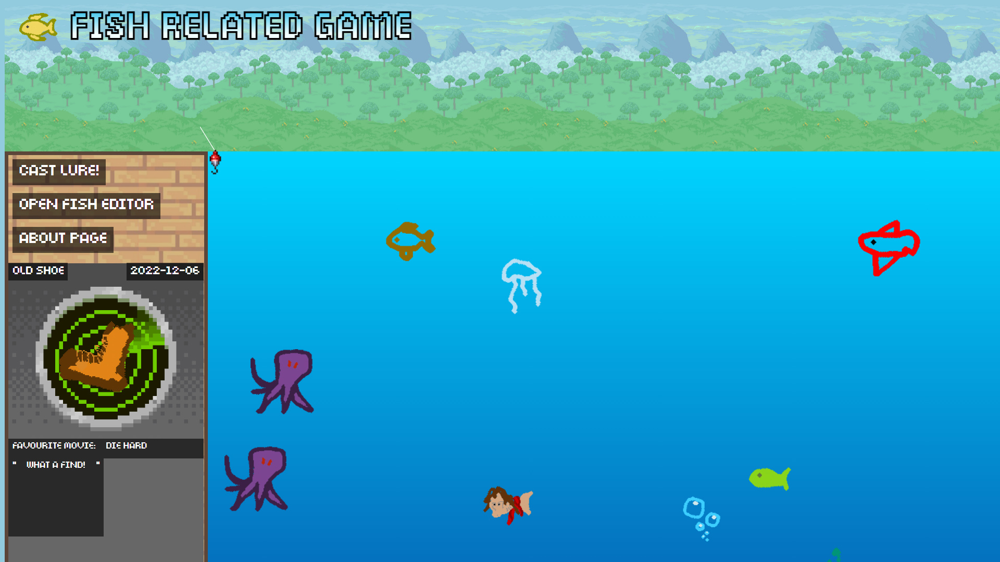
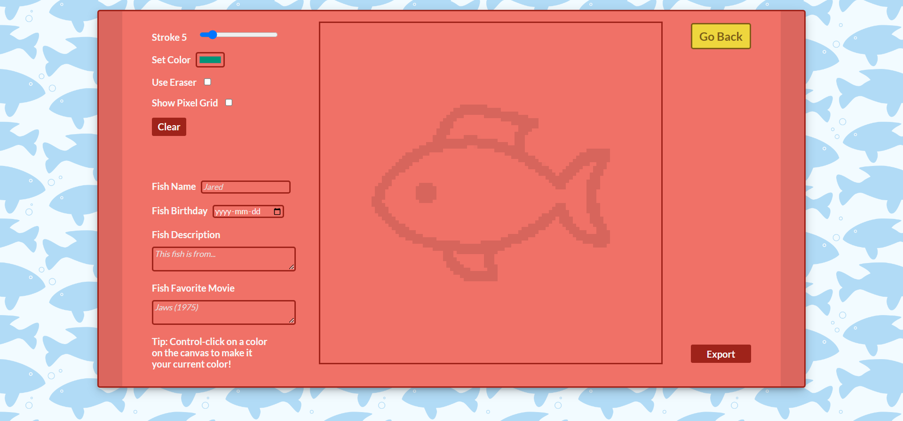

# Fish Related Game

### **Check us out on the CS290 Fall 2022 [Hall of Fame](https://web.engr.oregonstate.edu/~hessro/teaching/hof/cs290#f22)**

**Members:** Erik Tornquist, Max Wild, Oliver Flood, Pavlo Havrylyuk

Well, it’s oh-fish-ial. Fish Related Game is a fin-tastic fishing game where players catch fish created by other players. 
You can draw your wildest fish ideas into reality and throw them into a public pool of fish stored in a dynamic JSON database. 
This harnesses the previously untapped potential of using your own player base for the labor of asset creation. 
Fish Related Game is powered by Express.

## Installation/Running
Commands to install packages:

`npm install`

Commands to run server:

`npm start`
(Will restart server automatically with updates to js, json files)

